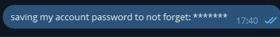
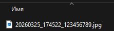

> [!CAUTION]
>
> ### ДИСКЛЕЙМЕР
>
> Данный проект и сопровождающие его исходные коды предоставлены исключительно в образовательных и исследовательских целях для демонстрации работы атаки **“Man‑in‑the‑Middle” (MITM)** проектом **Telega**.

# Telega - Proof of Concept MITM attack

## Предыстория

**Telega** 18 марта включила в работу своего приложения собственные DC-прокси, отказавшись от использования стандартных прокси MTProto. Самое главное в этом событии то, что **разработчики заменили в клиенте пару RSA ключей**. Данные, которые передаются от клиента на сервера **Telega** теперь шифруются другим публичным ключом, отличным от стандартного ключа Telegram. На серверах **Telega** данные расшифровываются приватным ключом из этой новой пары RSA (который знают только они), а затем уже обратно шифруются публичным ключом настоящего Telegram, чтобы конечный сервер смог их распознать и расшифровать.

**24 марта Telega [предоставила ответы](https://telegra.ph/Otvety-na-sostavlennye-voprosy-po-telega-kotorye-skidyvali-v-predlozhku-03-24) на вопросы безопасности:**

> **Telega: переписка пользователей передаётся по протоколу MTProto и остаётся зашифрованной на всём протяжении соединения. Наличие дополнительных ключей или различий в параметрах соединения не даёт доступа к содержимому сообщений.**

**Их ответ - наглая ложь. Именно это и будет здесь доказано.**

*Более подробно можете прочитать тут - https://dontusetelega.lol/analysis  
А также посмотреть посты с ресерчем тут - https://t.me/bruhcollective*

## 0. Подготовка

Необходимо собрать свое приложение Telegram, изменив части исходного кода, как это сделала **Telega**  

1. Изменение айпи DC серверов на прокси. 127.0.0.1 - локальный прокси, который мы запустим. Telega их подгружает через ендпоинт, но тут позволим себе захардкодить.
```diff
const BuiltInDc kBuiltInDcs[] = {
-	{ 1, "149.154.175.50" , 443 },
-	{ 2, "149.154.167.51" , 443 },
-	{ 2, "95.161.76.100"  , 443 },
-	{ 3, "149.154.175.100", 443 },
-	{ 4, "149.154.167.91" , 443 },
-	{ 5, "149.154.171.5"  , 443 },
+   { 1, "127.0.0.1" , 443 },
+	{ 2, "127.0.0.1" , 443 },
+	{ 3, "127.0.0.1", 443 },
+	{ 4, "127.0.0.1" , 443 },
+	{ 5, "127.0.0.1"  , 443 },
};
```

2. Изменяем публичный RSA ключ. Генерируем пару с помощью `python mitm_dc.py generate-keys` (скрипт сразу выведет, чем нужно подменить)
```diff
const char *kPublicRSAKeys[] = { "\
-----BEGIN RSA PUBLIC KEY-----\n\
-MIIBCgKCAQEA6LszBcC1LGzyr992NzE0ieY+BSaOW622Aa9Bd4ZHLl+TuFQ4lo4g\n\
-5nKaMBwK/BIb9xUfg0Q29/2mgIR6Zr9krM7HjuIcCzFvDtr+L0GQjae9H0pRB2OO\n\
-62cECs5HKhT5DZ98K33vmWiLowc621dQuwKWSQKjWf50XYFw42h21P2KXUGyp2y/\n\
-+aEyZ+uVgLLQbRA1dEjSDZ2iGRy12Mk5gpYc397aYp438fsJoHIgJ2lgMv5h7WY9\n\
-t6N/byY9Nw9p21Og3AoXSL2q/2IJ1WRUhebgAdGVMlV1fkuOQoEzR7EdpqtQD9Cs\n\
-5+bfo3Nhmcyvk5ftB0WkJ9z6bNZ7yxrP8wIDAQAB\n\
+GENERATED_PUBLIC_KEY_HERE
-----END RSA PUBLIC KEY-----" };
```

3. В конструкторе делаем настройку DC неизменяемой, чтобы `help.getConfig` не изменил айпи нашего прокси.
```diff
DcOptions::DcOptions(const DcOptions &other)
: _environment(other._environment)
, _data(other._data)
, _cdnDcIds(other._cdnDcIds)
, _publicKeys(other._publicKeys)
, _cdnPublicKeys(other._cdnPublicKeys)
-, _immutable(other._immutable) {
+, _immutable(true) {
}
```

4. Собираем бинарник. Пример сборки - https://github.com/AyuGram/AyuGramDesktop/blob/dev/docs/building-win-x64.md

5. Запускаем прокси `python mitm_dc.py run`

## 1. Дальше безопасности нет

Открываем собранный бинарник (подобный Telega) и авторизовываемся. **Вы уже подверглись атаке MITM.** Telega уже имеет полный доступ к сессии через перехваченный `auth_key`. **Она может расшифровывать все данные, которые проходят через Вас.**  

В примере DC-прокси `mitm_dc.py`, который по сути минимально эмулирует работу DC-прокси серверов Telega, встроена **расшифровка контактов, отправляемых и входящих сообщений в личке/чате/канале, сохранение отправляемых файлов/media**. И это только минимальный набор того, что теперь можно делать.

##

**Сразу при открытии парсятся контакты в mitm_media/contacts_\*\*.json** (все данные изменены):  
>"users": [
    "id=194162455, name='Юрист', @urist, phone=79279517445"
  ],

##

**Отправляем сообщение себе в избранное:**  
  
**Видим в логах:**  
> DECODED messages.sendMessage →self: 'saving my account password to not forget:\*\*\*\*\*\*  

##

**Отправляем сообщение другу:**  
  
**Видим в логах и айди друга, и само сообщение:**  
> DECODED messages.sendMessage →user(526781221): 'не сегодня'

##

**Нам приходит сообщение:**  
  
**Видим все в логах:**  
> DECODED updateShortChatMessage MSG ←chat(5067891234) from user(6123456789): 'Секрет!'

##

**Отправляем файл/медиа:**  
  
**Прокси сохраняет копию локально в mitm_media**  
  

> Saved upload: ~\mitm_media\20260325_174522_123456789.jpg (7725B)  
DECODED messages.sendMedia →self [photo → 20260325_174522_123456789.jpg]

## 2. А как же MTProto?

Именно MTProto прикрываются **Telega** в своем ответе.  

Безопасность MTProto строится на одном допущении: **клиент доверяет только настоящему серверу Telegram**. Это доверие основано на RSA-ключе, вшитом в приложение.

Если ключ подменён — всё шифрование становится бесполезным:

| Этап | Что происходит нормально | Что происходит с Telega|
|------|--------------------------|------------------------|
| Обмен ключами (DH) | Клиент проверяет сервер по RSA | Клиент проверяет прокси по **подмененному** RSA |
| Шифрование | Ключ знают только клиент и сервер | Telega имеет **оба** ключа |
| Передача | Сообщение зашифровано end-to-server | Telega расшифровывает, читает, пересылает |

## 3. Заключение

**Подмена RSA ключей - прямой факт желания контролировать ваше нахождение в мессенджере. Их DC-прокси не принимает шифрование оригинальным публичным ключом Telegram.**  

Примеры из первой части - лишь верхушка айсберга. **Telega** не выкладывает полный исходный код, а тот что есть - неактуальный. В любой момент они могут добавить что-то ещё. **Все их ответы, что они не имеют доступа к вашим сообщениям - ложь.**  
Пользуйтесь оригинальным клиентом с использованием прокси, не нужно подвергать себя лишним рискам.